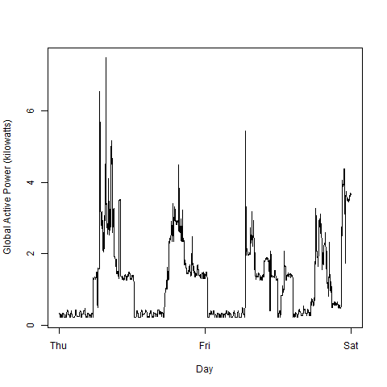
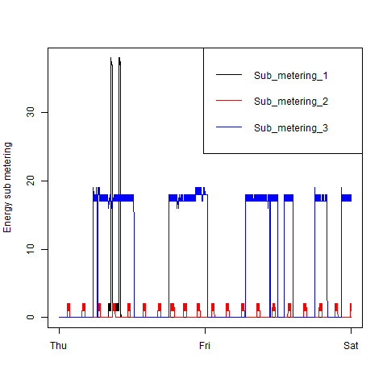

## Introduction

This assignment uses data from
the <a href="http://archive.ics.uci.edu/ml/">UC Irvine Machine
Learning Repository</a>, a popular repository for machine learning
datasets. In particular, we will be using the "Individual household
electric power consumption Data Set" which I have made available on
the course web site:


* <b>Dataset</b>: <a href="https://d396qusza40orc.cloudfront.net/exdata%2Fdata%2Fhousehold_power_consumption.zip">Electric power consumption</a> [20Mb]

* <b>Description</b>: Measurements of electric power consumption in
one household with a one-minute sampling rate over a period of almost
4 years. Different electrical quantities and some sub-metering values
are available.


The following descriptions of the 9 variables in the dataset are taken
from
the <a href="https://archive.ics.uci.edu/ml/datasets/Individual+household+electric+power+consumption">UCI
web site</a>:

<ol>
<li><b>Date</b>: Date in format dd/mm/yyyy </li>
<li><b>Time</b>: time in format hh:mm:ss </li>
<li><b>Global_active_power</b>: household global minute-averaged active power (in kilowatt) </li>
<li><b>Global_reactive_power</b>: household global minute-averaged reactive power (in kilowatt) </li>
<li><b>Voltage</b>: minute-averaged voltage (in volt) </li>
<li><b>Global_intensity</b>: household global minute-averaged current intensity (in ampere) </li>
<li><b>Sub_metering_1</b>: energy sub-metering No. 1 (in watt-hour of active energy). It corresponds to the kitchen, containing mainly a dishwasher, an oven and a microwave (hot plates are not electric but gas powered). </li>
<li><b>Sub_metering_2</b>: energy sub-metering No. 2 (in watt-hour of active energy). It corresponds to the laundry room, containing a washing-machine, a tumble-drier, a refrigerator and a light. </li>
<li><b>Sub_metering_3</b>: energy sub-metering No. 3 (in watt-hour of active energy). It corresponds to an electric water-heater and an air-conditioner.</li>
</ol>

## Loading the data


When loading the dataset into R, please consider the following:

* The dataset has 2,075,259 rows and 9 columns. First
calculate a rough estimate of how much memory the dataset will require
in memory before reading into R. Make sure your computer has enough
memory (most modern computers should be fine).

* We will only be using data from the dates 2007-02-01 and
2007-02-02. One alternative is to read the data from just those dates
rather than reading in the entire dataset and subsetting to those
dates.

* You may find it useful to convert the Date and Time variables to
Date/Time classes in R using the `strptime()` and `as.Date()`
functions.

* Note that in this dataset missing values are coded as `?`.


## Making Plots

Our overall goal here is simply to examine how household energy usage
varies over a 2-day period in February, 2007. Your task is to
reconstruct the following plots below, all of which were constructed
using the base plotting system.

First you will need to fork and clone the following GitHub repository:
[https://github.com/rdpeng/ExData_Plotting1](https://github.com/rdpeng/ExData_Plotting1)


For each plot you should

* Construct the plot and save it to a PNG file with a width of 480
pixels and a height of 480 pixels.

* Name each of the plot files as `plot1.png`, `plot2.png`, etc.

* Create a separate R code file (`plot1.R`, `plot2.R`, etc.) that
constructs the corresponding plot, i.e. code in `plot1.R` constructs
the `plot1.png` plot. Your code file **should include code for reading
the data** so that the plot can be fully reproduced. You should also
include the code that creates the PNG file.

* Add the PNG file and R code file to your git repository

When you are finished with the assignment, push your git repository to
GitHub so that the GitHub version of your repository is up to
date. There should be four PNG files and four R code files.


The four plots that you will need to construct are shown below. 


### Plot 1


 


### Plot 2

 


### Plot 3

 


### Plot 4

 


## Solution
There are four scripts that generates the above plots
* [plot1.R](https://github.com/schuang29/ExploringData_Plotting_Project1/blob/master/plot1.R)
* [plot2.R](https://github.com/schuang29/ExploringData_Plotting_Project1/blob/master/plot2.R)
* [plot3.R](https://github.com/schuang29/ExploringData_Plotting_Project1/blob/master/plot3.R)
* [plot3.R](https://github.com/schuang29/ExploringData_Plotting_Project1/blob/master/plot4.R)

Besides the plotting, the script has commonality in the i/o processing and data preparation.
### Source the data

#### Housekeeping
First set the working directory
```R
setwd("D:/GitHub/ExData_Plotting1")
```

#### Download file, if it hasn't already been completed
```R
fileUrl <- "https://d396qusza40orc.cloudfront.net/exdata%2Fdata%2Fhousehold_power_consumption.zip"
download.file(fileUrl, destfile = "./Course3Week4Assign1/Course3Week4Assign1.zip", mode = "wb")
if(!file.exists("Project1.zip")){download.file(fileUrl, destfile = "Project1.zip", mode = "wb")}
```

#### Unzip the file
```R
unzip("Project1.zip")
```

#### Read data into a table
```R
data <- read.table("household_power_consumption.txt", 
                   header=T, 
                   sep=";", 
                   na.strings="?")
```

#### Create a datetime variable and add to the table
```R
plotData <- data[data$Date %in% c("1/2/2007","2/2/2007"),]
SetTime <-strptime(paste(plotData$Date, plotData$Time, sep=" "),"%d/%m/%Y %H:%M:%S")
plotData <- cbind(SetTime, plotData)
```

#### Plot 1 - Frequency of Global Active Power
The following creates this plot:
```R
hist(plotData$Global_active_power, col="red", main="Global Active Power", xlab="Global Active Power (kilowatts)")
```


Copy the plot and save to file
```R
dev.copy(png,"plot1.png", width=480, height=480)
dev.off()
```

#### Plot 2 - Global Active Power over Days
The following creates this plot:
```R
plot(plotData$Global_active_power~plotData$SetTime, 
     type="l", 
     ylab="Global Active Power (kilowatts)", 
     xlab="Day")
```



Copy the plot and save to file
```R
dev.copy(png,"plot2.png", width=480, height=480)
dev.off()
```

#### Plot 3 - Submetering over time
The following creates this plot:
```R
plot(plotData$SetTime, plotData$Sub_metering_1, type="l", col="black", xlab="", ylab="Energy sub metering")
lines(plotData$SetTime, plotData$Sub_metering_2, col="red")
lines(plotData$SetTime, plotData$Sub_metering_3, col="blue")
legend("topright", 
       legend=c("Sub_metering_1", "Sub_metering_2", "Sub_metering_3"), 
       col=c("black", "red", "blue"), 
       lty="solid")
```



Copy the plot and save to file
```R
dev.copy(png,"plot3.png", width=480, height=480)
dev.off()
```

#### Plot 4 - Collage
The following creates this plot:
```R
par(mfrow=c(2,2), mar=c(4,4,2,1), oma=c(0,0,2,0))

plot(plotData$Global_active_power~plotData$SetTime, 
     type="l", 
     ylab="Global Active Power (kilowatts)", 
     xlab="")

plot(plotData$Voltage~plotData$SetTime, 
     type="l", 
     ylab="Voltage", 
     xlab="datetime")

plot(plotData$SetTime, plotData$Sub_metering_1, type="l", col="black", xlab="", ylab="Energy sub metering")
lines(plotData$SetTime, plotData$Sub_metering_2, col="red")
lines(plotData$SetTime, plotData$Sub_metering_3, col="blue")
legend("topright", 
       legend=c("Sub_metering_1", "Sub_metering_2", "Sub_metering_3"), 
       col=c("black", "red", "blue"),
       lty=1, 
       lwd=1,
       bty = "n")

plot(plotData$Global_reactive_power~plotData$SetTime, 
    type="l", 
    ylab="Global_reactive_power", 
    xlab="datetime")   
```


Copy the plot and save to file
```R
dev.copy(png,"plot4.png", width=480, height=480)
dev.off()
```